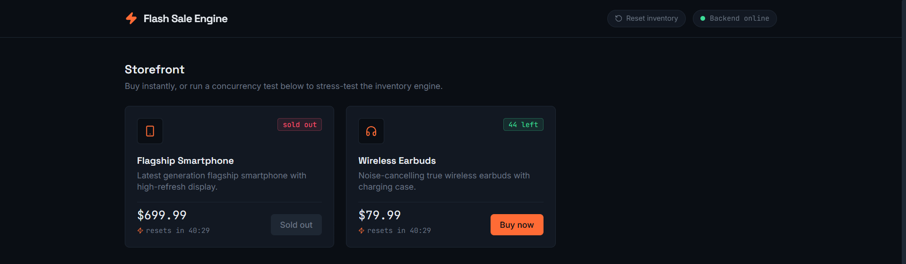
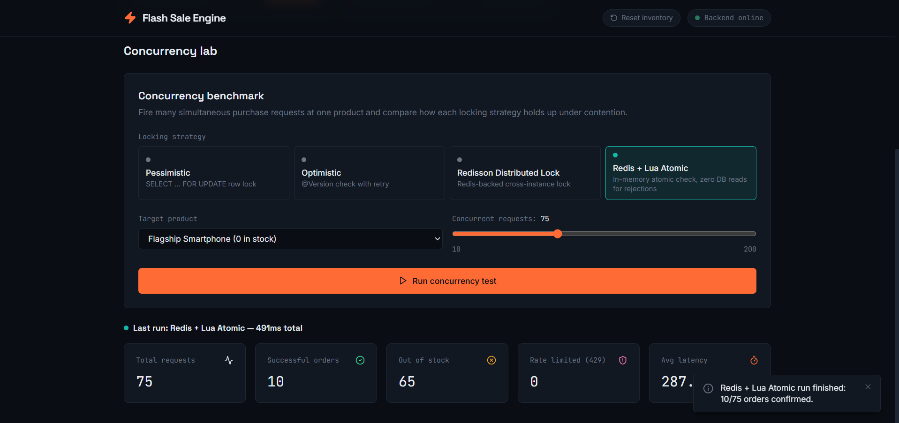
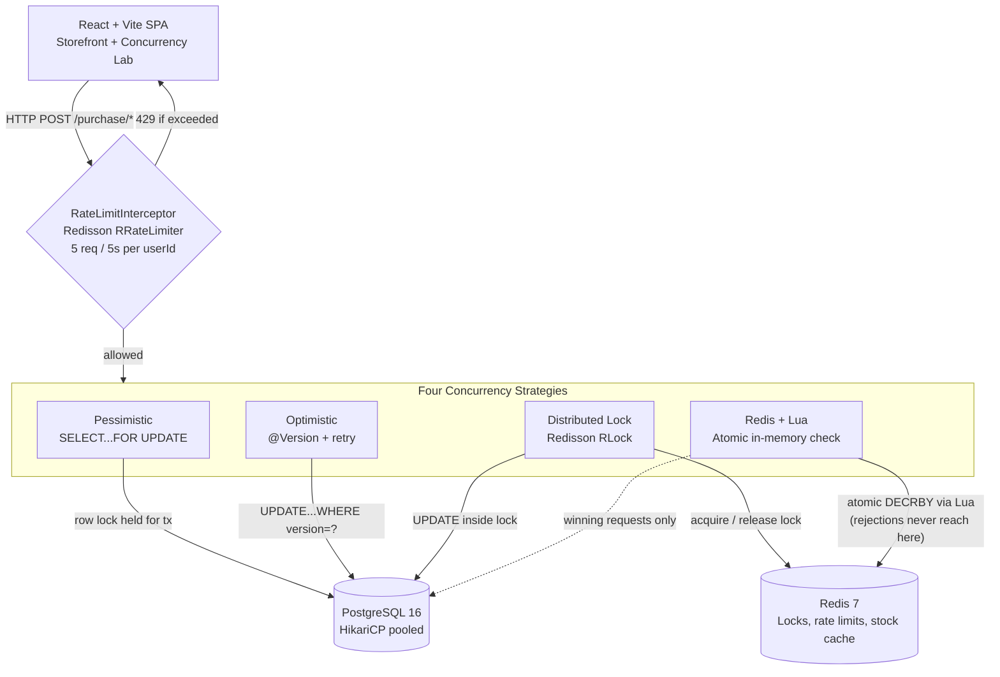

# ⚡ Flash Sale Engine

**A distributed, high-concurrency inventory management system built to survive real flash-sale traffic — four interchangeable locking strategies, rate-limited and benchmarked live.**

[](https://openjdk.org/)
[](https://spring.io/projects/spring-boot)
[](https://www.postgresql.org/)
[](https://redis.io/)
[](https://redisson.org/)
[](https://react.dev/)
[](https://vitejs.dev/)
[](https://www.docker.com/)
[](https://testcontainers.com/)
[](https://github.com/features/actions)

---

## The problem this solves

Flash sales create a specific, brutal concurrency problem: thousands of requests hit the exact same row of the exact same database table within milliseconds of each other, all trying to decrement a finite stock count. Get the concurrency control wrong and you either **oversell** inventory you don't have, or **grind the whole system to a halt** under lock contention.

This project implements and benchmarks **four fundamentally different concurrency control strategies** against the same problem, side by side, protected by a distributed rate limiter, so their real trade-offs are directly observable rather than theoretical.

---

## Live demo

<p align="center">
  
  <br/>
  <em>The live storefront — real-time stock badges, countdown timers, and one-click checkout running against the actual backend.</em>
</p>

<p align="center">
  
  <br/>
  <em>The Concurrency Lab mid-benchmark — 200 simultaneous requests fired at one product, with successful orders, out-of-stock rejections, rate-limited requests, and average latency measured live.</em>
</p>

---

## System architecture



---

## Concurrency strategy deep dive

| | **Pessimistic Lock** | **Optimistic Lock** | **Redisson Distributed Lock** | **Redis + Lua Atomic** |
|---|---|---|---|---|
| **Mechanism** | `SELECT ... FOR UPDATE` — locks the row for the transaction's full duration | JPA `@Version` — no lock; detects conflicts after the fact and retries | Redis `RLock` acquired before touching the DB, released in `finally` | Lua script atomically checks + decrements a Redis-cached counter before any DB access |
| **Throughput under high contention** | Low — requests physically queue at the database | Moderate — degrades as retry storms increase | Moderate–High — requests queue at Redis, faster to coordinate than the DB | **Highest** — every rejection is resolved entirely inside Redis, in-memory |
| **Best-case latency** | Moderate | Low | Moderate | **Lowest** |
| **DB connection pool saturation** | **High** — each waiting request holds an open connection + transaction for the entire lock duration | Low–moderate — connections held briefly per attempt, retries add churn | Low — a DB connection is only opened after the lock is won | **Lowest** — 100% of out-of-stock requests use zero database connections |
| **Deadlock risk** | Present in multi-row scenarios (not triggered here, since only one row is ever locked per transaction) | None | Low — mitigated by the mandatory lease time, which force-releases a lock even if the holder crashes | None |
| **Data consistency** | Strong — Postgres is the single source of truth | Strong — Postgres is the single source of truth | Strong — Postgres is the single source of truth | **Eventually consistent** — Redis and Postgres can briefly diverge if the DB write fails after Redis already won the reservation; this project compensates automatically by rolling the Redis count back on failure, but the theoretical window exists |
| **When to reach for it** | Simple systems, single DB instance, correctness over raw throughput | Low-to-moderate contention, read-heavy workloads with occasional conflicts | Multi-instance deployments needing cross-service coordination | Extreme-contention flash sales where minimizing database load during the rejection storm is the priority |

**On rate limiting:** every purchase endpoint sits behind a Redisson `RRateLimiter` token bucket — 5 requests per 5 seconds, keyed per `userId` (extracted from the request body via a caching request wrapper, since a userId embedded in JSON isn't available to a servlet interceptor by default). Exceeding it returns `429 Too Many Requests` before any locking strategy is even invoked.

---

## API documentation

### Products

| Method | Endpoint | Description | Response |
|---|---|---|---|
| `GET` | `/api/products` | List all products with current stock | `200 OK` — array of `ProductResponse` |
| `GET` | `/api/products/{id}` | Get a single product | `200 OK`, or `404` if not found |
| `POST` | `/api/products/reset` | Reset stock to defaults, flush Redis locks, re-warm the Redis stock cache | `200 OK` — updated products |

### Flash Sale Purchasing

All four accept the same body: `{ "userId": 1, "productId": 1, "quantity": 1 }`

| Method | Endpoint | Strategy |
|---|---|---|
| `POST` | `/api/flash-sale/purchase/pessimistic` | `SELECT ... FOR UPDATE` |
| `POST` | `/api/flash-sale/purchase/optimistic` | `@Version` + automatic retry |
| `POST` | `/api/flash-sale/purchase/distributed` | Redisson `RLock` |
| `POST` | `/api/flash-sale/purchase/redis-lua` | Redis Lua atomic stock check |

**Error response shape** (all endpoints):
```json
{
  "timestamp": "2026-09-22T00:00:00",
  "status": 429,
  "error": "Too Many Requests",
  "message": "Rate limit exceeded: max 5 purchase requests per 5 seconds per user.",
  "path": "/api/flash-sale/purchase/optimistic"
}
```

| Status | Meaning |
|---|---|
| `400` | Request validation failed |
| `404` | Product not found |
| `409` | Insufficient stock, or a lock/version conflict |
| `429` | Rate limit exceeded |
| `500` | Unexpected server-side failure |

---

## Tech stack

**Backend:** Java 17+, Spring Boot 3.3, Spring Data JPA, Spring Data Redis, Redisson 3.35.0, PostgreSQL 16, HikariCP, Lombok, Maven

**Testing:** JUnit 5, Testcontainers (Postgres + Redis), GitHub Actions CI

**Frontend:** React 18, Vite 5, Tailwind CSS, Axios, Lucide Icons

**Infrastructure:** Docker, Docker Compose, multi-stage Docker builds, Eclipse Temurin JRE 21

---

## Local setup

### Prerequisites
- [Docker Desktop](https://www.docker.com/products/docker-desktop/)
- [JDK 21](https://adoptium.net/)
- [Node.js 18+](https://nodejs.org/)

### 1. Start infrastructure
```bash
docker compose up -d
docker compose ps   # both containers should show "healthy"
```

### 2. Start the backend
```bash
cd backend
mvn clean install
mvn spring-boot:run
```
Runs on `http://localhost:8080`, seeds 2 products, and warms the Redis stock cache automatically.

### 3. Start the frontend
```bash
cd frontend
npm install
npm run dev
```
Runs on `http://localhost:5173`.

### 4. Run the automated tests
```bash
cd backend
mvn test
```
Spins up throwaway Testcontainers-managed Postgres and Redis instances and verifies 50 concurrent purchases against 10 units of stock never oversell.

### 5. Run the full stack in production mode
```bash
docker compose -f docker-compose.prod.yml up -d --build
```
Builds the backend into an optimized multi-stage image and runs the entire stack (app + database + cache) with nothing but port 8080 exposed to the host.

---

## Project structure